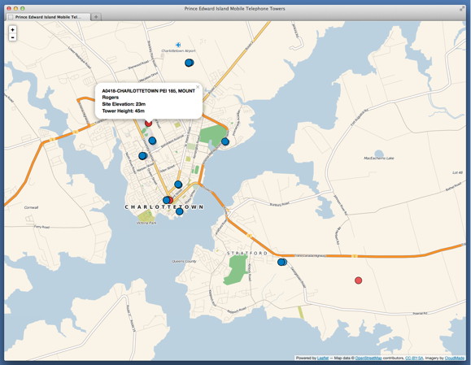
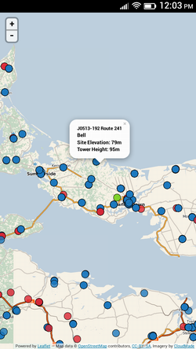

Prince Edward Island Cell Sites
===============================

This script generates a [GeoJSON](http://www.geojson.org/geojson-spec.html) representation of cellular telephone sites in Prince Edward Island, Canada by scraping data from the [Industry Canada Spectrum Direct](http://sd.ic.gc.ca/pls/engdoc_anon/web_search.geographical_input) database.

Each transmitter is represented as a "feature":

	{
	  "type": "Feature",
	  "properties": {
	    "shortcompany": "Bell",
	    "company": "Bell Canada",
	    "call_sign": "SITE365029",
	    "location": "Mountain Rd  394",
	    "longitude": "645028",
	    "latitude": "460708",
	    "site_elevation": "49",
	    "structure_height": "30",
	    "colour": "#1E7BC0"
	  },
	  "geometry": {
	    "type": "Point",
	    "coordinates": [
	      -64.841111111111,
	      46.118888888889
	    ]
	  }
	}
	
Requirements
------------

* PHP with cURL and SimpleXML support

How to Run
----------

	cd generate
	php extract_from_industry_canada.php
 
This will dump the GeoJSON file into [../www/data/towers.geojson](../www/data/towers.geojson) where it can be viewed with the [Leaflet-based map demonstration](../www/index.html).

Screenshots
===========

Firefox Desktop Browser
-----------------------

Firefox OS on a Geeksphone Peak Mobile Phone
--------------------------------------------

