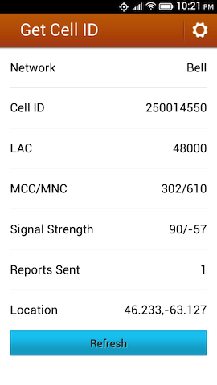
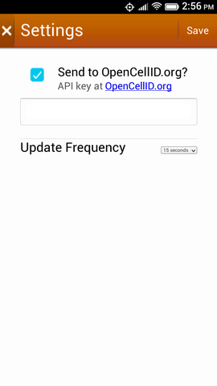

Get Cell ID
===========

This is an open web app, targetted at Firefox OS and tested initially on the Geeksphone Peak, that grabs the current cellular network ID (the MCC, MNC, LAC and Cell ID) and displays them.

The app will also, optionally, upload this information to the [OpenCellID.org](http://opencellid.org) project via its API.

Data Usage
----------

In my testing (using the "Usage" app on my Geeksphone Peak), the app uses data as follows:

* initial A-GPS call: 1.42KB
* every OpenCellID.org update: 2.13KB

This means that if you leave the app set at the default update frequency of 30 seconds, and left it running all day, the app would update 2,880 times and consume 6134KB (about 6MB) of data. If you set the update frequency to 5 minutes, the app will update 288 times a day and consume 613KB.

To Do
-----

* Handle failure, especially of the OpenCellID.org update, more gracefully (or, indeed, at all), and perhaps check the OpenCellID.org key for validity when it's saved on the "Settings" page.
* Make the Cell ID "clickable", generating a query to the OpenCellID.org API that accepts a Cell ID and returns its guess of geolocation.

Uses
----

* [Zepto.js](http://zeptojs.com/)
* [Moment.js](http://momentjs.com/)

Screenshots
-----------

