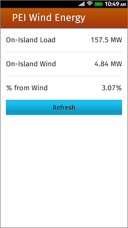

Prince Edward Island Wind Energy App
====================================

Introduction
------------

This is my first go at developing an app for Firefox OS. It's nothing complicated nor spectacular: just a basic experiment with how to structure an app and how to do cross-domain XMLHttpRequest calls from an app (which turned out to be a lot simpler than I imagined).

The app itself simply grabs [a JSON feed of Prince Edward Island electricity generation data](http://energy.reinvented.net/pei-energy/govpeca/get-govpeca-data.php?format=json-noheaders) and displays the current load, wind energy generation and percentage, with a "Refresh" button that if tapped loads fresh data from the feed.

How to Run
----------

The app runs fine in the Firefox OS emulator and on Firefox OS devices; it won't, however, run in Firefox on a desktop browser because the browser doesn't have sufficient XMLHttpRequest permissions.

To run the app in the Firefox OS emulator, just load up the manifest.webapp; no additional steps are needed. You can then, if you have a device, push the app from there.

Borrowed from Elsewhere
-----------------------

* [Zepto.js](http://zeptojs.com/) - overkill for my needs here, but I wanted to try it out as a lightweight jQuery replacement.
* Some of the CSS from [Gaia](https://github.com/mozilla-b2g/gaia/tree/master/shared) (to avoid reinventing the wheel); the [Building Firefox OS](http://buildingfirefoxos.com/) site was a useful guide to all of this.

Screenshot
----------

Credits
-------

Peter Rukavina
[http://ruk.ca/](http://ruk.ca/)

