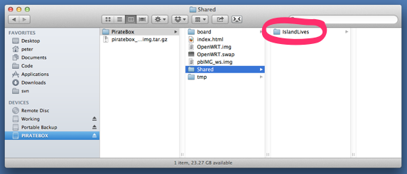
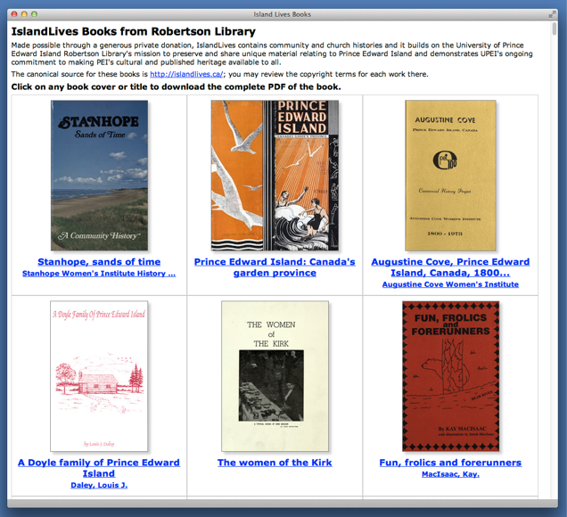
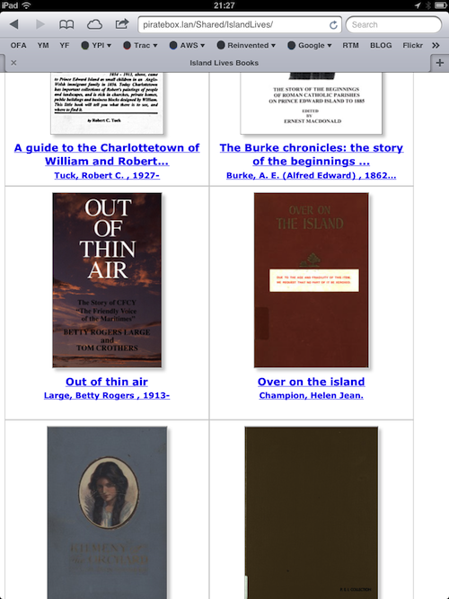
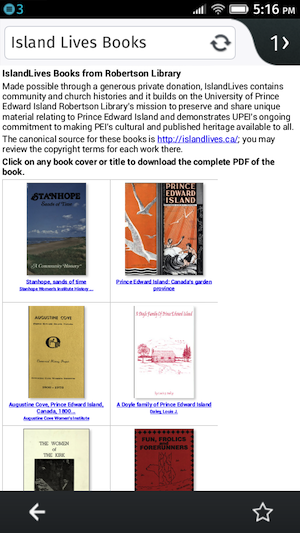

PirateBox Version of IslandLives
================================

[IslandLive.ca](http://IslandLive.ca) is a repository of local community historys from Prince Edward Island, Canada assembled by [Robertson Library](http://library.upei.ca), University of Prince Edward Island.

IslandLives uses Islandora to store and present books, and the script you find here will scrape content out of IslandLives and into a standalone folder of PDF files, thumbnails and an index.html file suitable for serving on a [PirateBox](http://wiki.daviddarts.com/PirateBox_DIY) that's not connected to the Internet.

While the code here is specific to IslandLives, it would be trivial to use it to create standalone repositories of similar content from other Islandora sites or, indeed, of any content that can be harvested by [OAI](http://http://www.openarchives.org/).

Requirements
------------

* PHP (with [SimpleXML](http://php.net/manual/en/book.simplexml.php))
* [wget](http://www.gnu.org/software/wget/)

How to Run
----------

Edit the $oai_base_url, $oai_base_url and $piratebox_directory as needed (if you just want to harvest IslandLives, then you shouldn't need to change these).

Then just run:

	php harvest-islandlives.php

This will start harvesting IslandLives into your $piratebox_directory directory, grabbing, for each book for which a PDF file is avaialble, the PDF, a thumbnail, and added an entry into the index.html file.

*Note that IslandLives contains a lot of records that don't have a digitized PDF attached, and these appear to be returned later in the list by OAI. So what happens now is that the script will harvest the 199 existing PDF files, but then keep cycling through all the without-a-PDF records until it finishes. It would be nice to prevent this, but it's harmless.*

Copying to PirateBox
--------------------

Set up a [PirateBox](http://http://wiki.daviddarts.com/PirateBox_DIY) -- it's easy to do and the hardware will cost you less than $50.

Once you're set up, power down your PirateBox, remove the USB memory stick and insert it into the computer where you ran this script, and copy your $piratebox_directory directory into the **PirateBox/Shared** directory:

Put the USB stick back in your PirateBox, power it up, and you should find your $piratebox_directory is available to you under the "Browse and download files here" link.

Screenshots
-----------

### Safari running on a MacBook

### Mobile Safari on an iPad

### Firefox OS Browser on a Geeksphone Peak

